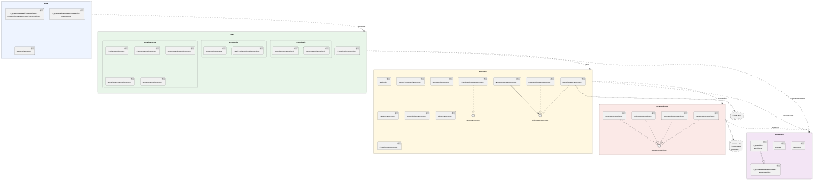
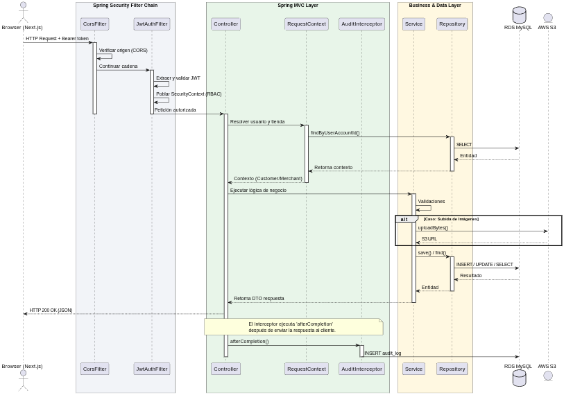

# GUIA DE TRABAJO

## Overview
Esta guia es para poder orientar a los desarrolladores el flujo de trabajo para la integración del proyecto.
Principalmente contamos con 2 ramas base
1. Development
2. Main

## Development
Esta rama está orientada para el desarrollo de tareas y pruebas antes de agregarlo al producto final.
Los desarrolladores tendrán que crear sus ramas basadas en esta para poder realizar el proceso de **integración**

## Main
Está es la rama produción y se usará unicamente para las presentaciones del proyecto. Todo lo que se integre aca tendrá que estar debidamente probado en **Development**



## Flujo del Proceso

### 1. Creación de la rama de trabajo
```bash
git checkout Development
git pull origin Development
git checkout -b KS-feature-description
```

### 2. Desarrollo y regular Rebasing

* El desarrollador debe trabajar en su rama creada para el respectivo task que se le asignó
* Ejecuten un rebase cada día o cuando se le informé que la rama **Development** fue actualizada

```bash
git fetch origin
git rebase -i origin/Development
```

* Cree commits constantemente con mensajes claros para tener conocimiento de lo desarrollado
```bash
git commit -m "KS-feature-description: implement user authentication"
```

### 3. Push & Create Pull Request

```bash
git push origin feature/JIRA-123-feature-description
```

* Crear un Pull Request hacia **Development**
* Agregue detalles sobre lo que se hizo para ese ticket

---

## Desarrollo Local

### Requisitos previos

- Java 21 ([descargar](https://adoptium.net/))
- Maven (o usar el wrapper `./mvnw` incluido — no requiere instalación)
- IDE recomendado: IntelliJ IDEA

### Configuración inicial (solo una vez)

**1. Crear el archivo `.env`:**

Linux/Mac:
```bash
cp .env.example .env
```
Windows:
```cmd
copy .env.example .env
```
El `.env` ya viene con los valores correctos para local. No es necesario modificarlo.

> `.env` está en `.gitignore` — nunca se sube al repositorio.

**2. Cargar las variables de entorno:**

> **Por qué es necesario:** `JWT_SECRET` y `JASYPT_ENCRYPTOR_PASSWORD` se leen directamente del entorno del proceso. Si no están cargadas, el JWT no funcionará y las propiedades cifradas (`ENC(...)`) no podrán desencriptarse.
> `SPRING_PROFILES_ACTIVE` ya tiene `local` como valor por defecto en `application.properties`, así que el perfil siempre se activa aunque no cargues el `.env`.

Linux/Mac:
```bash
export $(grep -v '^\s*#' .env | grep -v '^\s*$' | xargs)
```

Windows (PowerShell):
```powershell
Get-Content .env | Where-Object { $_ -notmatch '^\s*#' -and $_ -match '=' } | ForEach-Object { $k,$v = $_ -split '=',2; [System.Environment]::SetEnvironmentVariable($k,$v) }
```

Windows (CMD):
```cmd
for /f "usebackq tokens=1,* delims==" %a in (.env) do @if not "%a:~0,1%"=="#" if not "%a"=="" set "%a=%b"
```

**3. Levantar el proyecto:**

Linux/Mac:
```bash
./mvnw spring-boot:run -pl app -am
```

Windows:
```cmd
mvnw.cmd spring-boot:run -pl app -am
```

> El flag `-am` (also make) compila primero los módulos dependientes (`domain`, `repository`, `service`, `api`) antes de levantar `app`.

El backend queda disponible en `http://localhost:8080`.

---

### Perfiles de Spring Boot

Spring Boot carga siempre `application.properties` como base, y encima aplica los overrides del perfil activo:

| Perfil | Cuándo se usa | Archivo de overrides | Base de datos |
|--------|--------------|----------------------|---------------|
| `local` | Desarrollo en tu máquina | `application-local.properties` | RDS compartida (dev) |
| `prod`  | Servidor EC2 | `application-prod.properties` | RDS compartida (prod) |

El perfil activo se controla con la variable de entorno `SPRING_PROFILES_ACTIVE`. En tu `.env` local ya viene configurado como `local` — no necesitas cambiarlo.

> **Requisito para el perfil `local`:** tu IP debe estar en el Security Group del RDS (puerto 3306). Si obtienes `Access denied` al arrancar, pide al responsable de AWS que agregue tu IP como regla inbound.

> **Para despliegue en EC2:** el `.env` del servidor debe tener `SPRING_PROFILES_ACTIVE=prod`. Con ese valor, Spring ignora `application-local.properties` y conecta al RDS de producción.

---

### Correr los tests

Los tests usan **H2 en memoria** — no requieren conexión a RDS ni variables de entorno configuradas.

Linux/Mac:
```bash
# Correr todos los tests
./mvnw test

# Correr tests + reporte de cobertura (mínimo 90%)
./mvnw verify
```

Windows:
```cmd
mvnw.cmd test
mvnw.cmd verify
```

El reporte de cobertura queda en `app/target/site/jacoco-aggregate/index.html`.

---

### Levantar desde IntelliJ IDEA

1. Abrir el proyecto desde la raíz (`/Backend`)
2. IntelliJ detecta automáticamente el proyecto Maven multi-módulo
3. Ir a **Run > Edit Configurations...**
4. Si no existe, crear una nueva configuración: **+ > Application**
5. Configurar:
   - **Main class:** `pe.edu.pucp.kingstore.KingstoreBackendApplication`
   - **Module:** `kingstore-backend.app`
   - **Environment variables** (hacer clic en el ícono de carpeta a la derecha del campo):
     ```
     JASYPT_ENCRYPTOR_PASSWORD=kingstore-secret-key-2024
     SPRING_PROFILES_ACTIVE=local
     JWT_SECRET=kingstore-secret-key-ingesoft-2026
     ```
6. Hacer clic en **OK** y correr con el botón ▶

> **Alternativa con plugin EnvFile:** IntelliJ tiene el plugin [EnvFile](https://plugins.jetbrains.com/plugin/7861-envfile) que permite apuntar directamente al archivo `.env` en lugar de copiar las variables manualmente. En **Run/Debug Configurations → EnvFile tab**, activar _Enable EnvFile_ y agregar el `.env` del proyecto.

---

### Estructura del proyecto

```
Backend/
├── domain/       # Entidades JPA y DTOs
├── repository/   # Repositorios Spring Data
├── service/      # Lógica de negocio
├── api/          # Controllers REST y configuración de seguridad
└── app/          # Módulo principal: arranca Spring Boot
    └── src/main/resources/
        ├── application.properties          # Config base (conecta a RDS)
        ├── application-local.properties    # Overrides para local (logs verbose)
        └── application-prod.properties     # Overrides para producción
```

---

### Variables de entorno locales

| Variable | Valor por defecto (local) | Descripción |
|----------|--------------------------|-------------|
| `JASYPT_ENCRYPTOR_PASSWORD` | `kingstore-secret-key-2024` | Descifra propiedades con `ENC(...)` |
| `SPRING_PROFILES_ACTIVE` | `local` | Activa el perfil local |
| `JWT_SECRET` | `kingstore-secret-key-ingesoft-2026` | Firma tokens JWT |
| `SPRING_DATASOURCE_PASSWORD` | *(usa valor cifrado en properties)* | Contraseña RDS (opcional) |

Para más detalles sobre el cifrado de propiedades, ver [`ENCRYPTION_GUIDE.md`](ENCRYPTION_GUIDE.md).

---

## Despliegue del Backend

El backend es una aplicación Spring Boot multi-módulo (Maven). Se despliega automáticamente en EC2 mediante GitHub Actions al hacer push a `main`. No se requiere Docker Hub ni intervención manual.


### Arquitectura

```
push a main
     │
GitHub Actions
     ├── ./mvnw package -DskipTests   → app/target/*.jar
     ├── docker build                  → imagen local (sin registry)
     ├── docker save | gzip | scp      → backend-image.tar.gz al EC2
     └── ssh: docker load + compose up
                    │
              EC2:8080 (Spring Boot)
                    │
              AWS RDS MySQL
```

### Datos del servidor

| Campo | Valor |
|-------|-------|
| IP EC2 | `100.57.218.181` |
| Puerto backend | `8080` |
| Directorio en servidor | `~/kingstore/backend/` |
| Conexión SSH | `ssh -i "kingstore_key.pem" ubuntu@ec2-100-57-218-181.compute-1.amazonaws.com` |

---

### Configuración inicial (solo una vez)

#### Secrets en GitHub

El workflow lee los secrets desde **Settings → Environments → production** del repositorio Backend. Deben estar configurados:

| Secret | Descripción |
|--------|-------------|
| `EC2_HOST` | IP del servidor (`100.57.218.181`) |
| `EC2_USER` | Usuario SSH (`ubuntu`) |
| `EC2_SSH_KEY` | Clave privada SSH (contenido del archivo `.pem`) |
| `EC2_KNOWN_HOSTS` | Output de `ssh-keyscan 100.57.218.181` |
| `JASYPT_ENCRYPTOR_PASSWORD` | Clave para desencriptar propiedades cifradas |
| `JWT_SECRET` | Clave para firmar tokens JWT |
| `SPRING_DATASOURCE_PASSWORD` | Contraseña de la base de datos MySQL en RDS |

> Las credenciales AWS (S3) las provee automáticamente el IAM Role asociado a la instancia EC2. No se configuran manualmente.

Para obtener el valor de `EC2_KNOWN_HOSTS`:
```bash
ssh-keyscan 100.57.218.181
```

---

### Publicar nueva versión

Solo hace falta hacer merge a `main`. El workflow `.github/workflows/backend-cd.yml` se activa automáticamente y:

1. Compila el JAR en el runner de GitHub Actions
2. Construye la imagen Docker
3. Transfiere la imagen al EC2 vía SSH/SCP
4. Levanta el contenedor con `docker-compose.production.yml`
5. Verifica que el puerto 8080 responda (hasta 90 segundos de espera)

Puedes seguir el progreso en la pestaña **Actions** del repositorio en GitHub.

---

### Ver logs del backend en el servidor

```bash
ssh -i "kingstore_key.pem" ubuntu@ec2-100-57-218-181.compute-1.amazonaws.com
cd ~/kingstore/backend

# Últimas 50 líneas
docker compose -f docker-compose.production.yml logs backend --tail=50

# En tiempo real (Ctrl+C para salir)
docker compose -f docker-compose.production.yml logs backend -f
```

---

### Apagar el backend

```bash
ssh -i "kingstore_key.pem" ubuntu@ec2-100-57-218-181.compute-1.amazonaws.com
cd ~/kingstore/backend
```

**Opción 1 — Detener el contenedor (se puede reiniciar):**
```bash
docker compose -f docker-compose.production.yml stop
```

**Opción 2 — Detener y eliminar el contenedor:**
```bash
docker compose -f docker-compose.production.yml down
```

**Opción 3 — Apagar y limpiar la imagen (el próximo CD la reconstruye):**
```bash
docker compose -f docker-compose.production.yml down --rmi all
```

> Los datos en RDS no se eliminan. Solo se detiene el contenedor.

---

### Variables de entorno del backend en producción

El workflow escribe automáticamente un archivo `.env` en `~/kingstore/backend/` en cada despliegue con las siguientes variables:

| Variable | Descripción |
|----------|-------------|
| `JASYPT_ENCRYPTOR_PASSWORD` | Clave para desencriptar propiedades sensibles en `application.properties` |
| `JWT_SECRET` | Clave para firmar y verificar tokens JWT |
| `SPRING_DATASOURCE_PASSWORD` | Contraseña de la base de datos MySQL en RDS |

`SPRING_PROFILES_ACTIVE=prod` se pasa directamente en `docker-compose.production.yml`.

---

## Arquitectura del Backend

### 1. Tipo de Arquitectura

El backend implementa una **Arquitectura Monolítica Modular por Capas** (Modular Layered Monolith). El proyecto es una única aplicación Spring Boot desplegada en un solo proceso y artefacto JAR, pero internamente está dividida en cinco módulos Maven con dependencias unidireccionales que imponen separación de responsabilidades estricta.

La dirección de dependencias es:

```
app → api → service → repository → domain
```

Ningún módulo inferior puede depender de uno superior. `domain` no conoce a nadie; `service` nunca importa clases de `api`.

---

### 2. Módulos

| Módulo | Responsabilidad |
|--------|----------------|
| `domain` | Entidades JPA (`@Entity`, `@MappedSuperclass`), DTOs de request/response y enumeraciones del negocio. No tiene dependencias externas. |
| `repository` | Interfaces que extienden `JpaRepository<T, Integer>`. Define las consultas a MySQL vía Spring Data JPA. Depende solo de `domain`. |
| `service` | Lógica de negocio, validaciones, generación de JWT, integración con S3. Define abstracciones (`CrudService`, `StorageService`) que el módulo `api` consume. |
| `api` | Controllers REST agrupados por rol (`admin/`, `merchant/`, `customer/`, `public_/`), filtro JWT, configuración CORS y el interceptor de auditoría. |
| `app` | Clase principal `@SpringBootApplication`, configuración condicional de S3Client y Jasypt. Empaqueta todos los módulos en el fat JAR. |

---

### 3. Patrones de Diseño

#### Repository Pattern
Todos los accesos a base de datos están encapsulados en interfaces del módulo `repository` que extienden `JpaRepository`. Los servicios nunca usan `EntityManager` directamente.

```
ProductRepository → JpaRepository<Product, Integer>
OrderRepository   → JpaRepository<Order, Integer>
```

#### Template Method
`AbstractCrudService<T>` implementa el flujo genérico de CRUD (crear, actualizar, desactivar, reactivar) dejando un método gancho `validateForSave(T entity)` vacío para que cada servicio concreto agregue sus propias validaciones sin duplicar el esqueleto.

```java
public abstract class AbstractCrudService<T extends BaseEntity> implements CrudService<T> {
    protected void validateForSave(T entity) { } // hook sobreescribible
}
```

#### Strategy Pattern
`StorageService` es una interfaz con dos implementaciones intercambiables seleccionadas mediante la propiedad `kingstore.storage.provider`:

| Implementación | Cuándo se activa | Qué hace |
|---------------|-----------------|----------|
| `LocalStorageService` | perfil `local` | Guarda archivos en disco (carpeta `upload-local/`) |
| `S3StorageService` | perfil `prod` | Sube archivos al bucket S3 via AWS SDK v2 |

`BulkUploadService` depende de `StorageService`, nunca de la implementación concreta.

#### Chain of Responsibility / Servlet Filter
`JwtAuthenticationFilter` extiende `OncePerRequestFilter`. Por cada request HTTP extrae el token del header `Authorization: Bearer <token>`, lo valida con `JwtUtil` y puebla el `SecurityContextHolder`. Si el token no está presente o es inválido, la cadena continúa sin autenticación (Spring Security rechaza el acceso si el endpoint lo requiere).

#### Interceptor Pattern (Post-Action Audit)
`AuditInterceptor` implementa `HandlerInterceptor.afterCompletion()`. Registra automáticamente cada mutación (POST, PUT, PATCH, DELETE) en la tabla `audit_log` con email del usuario, rol, endpoint, método HTTP, status code y nivel (`INFO`, `WARN`, `ERROR`). Las peticiones GET no se auditan.

#### Request-Scoped Context Object
`CustomerContext` y `MerchantContext` son beans de Spring con scope `request` y proxy `TARGET_CLASS`. Cada uno resuelve y cachea (por request) el usuario autenticado y su tienda asociada para que los controllers no repitan la misma consulta a base de datos dentro del mismo ciclo HTTP.

#### Conditional Bean / Factory
`S3Config` usa `@ConditionalOnProperty(name = "kingstore.storage.provider", havingValue = "s3")`. El bean `S3Client` solo se instancia en el perfil `prod`; en `local` el SDK de AWS nunca carga y el arranque es instantáneo.

#### Base Controller (Template con herencia)
`BaseMerchantController` es una clase abstracta que centraliza el manejo de excepciones (`ResourceNotFoundException`, `BusinessRuleException`, `DataIntegrityViolationException`) y utilidades compartidas (parseo, normalización, slugify). Todos los controllers del módulo comerciante lo extienden.

---

### 4. Conexión Backend ↔ Frontend

El frontend es una aplicación Next.js unificada con tres dominios (`cliente`, `admin`, `comerciante`), cada uno con su propio cliente HTTP que consume la API REST del backend en puerto `8080`.

#### Clientes HTTP del frontend

| Dominio | Variable de entorno | Base URL en prod |
|---------|--------------------|--------------------|
| `cliente` | `NEXT_PUBLIC_API_URL` | `http://100.57.218.181:8080` |
| `admin` | `NEXT_PUBLIC_API_URL` | `http://100.57.218.181:8080` |
| `comerciante` | `NEXT_PUBLIC_API_BASE_URL` | `http://100.57.218.181:8080` |

Las variables `NEXT_PUBLIC_*` se embeben en el bundle del navegador durante el build de Next.js en GitHub Actions. Un cambio de URL del backend requiere redesplegar el frontend.

#### Flujo de autenticación JWT

1. El frontend envía `POST /auth/login` (sin token) con email y contraseña.
2. El backend valida credenciales contra RDS MySQL, genera un JWT firmado con HMAC-SHA256 que incluye `userId`, `email`, `role` y `storeSlug`.
3. La expiración varía por rol: CUSTOMER (1 h), MERCHANT (2 h), SYSTEM\_ADMIN (4 h).
4. El frontend persiste el token en `localStorage` y lo adjunta en cada request: `Authorization: Bearer <token>`.
5. `JwtAuthenticationFilter` intercepta el request, valida el token y registra la autenticación en el `SecurityContextHolder`.
6. `SecurityConfig` autoriza el acceso por rol (`ROLE_SYSTEM_ADMIN`, `ROLE_MERCHANT`, `ROLE_CUSTOMER`).

#### CORS

La lista de orígenes permitidos se configura en `application.properties` bajo la clave `kingstore.cors.allowed-origin-patterns`. En producción incluye la IP del servidor EC2. Para agregar un dominio personalizado basta con añadirlo a esa propiedad y redesplegar.

#### Protocolo de transferencia

| Aspecto | Detalle |
|---------|---------|
| Protocolo | HTTP REST (JSON) |
| Autenticación | JWT Bearer token |
| Gestión de sesión | Stateless (`SessionCreationPolicy.STATELESS`) — sin cookies de sesión |
| CORS | Configurado en backend; credentials habilitadas (`allowCredentials: true`) |
| Subida de archivos | Multipart form-data para imágenes; almacenadas en S3 (prod) o disco (local) |

---

### 5. Diagramas PlantUML

#### Diagrama 1 — Arquitectura general del Backend



---

#### Diagrama 2 — Ciclo de vida de una petición autenticada



---
